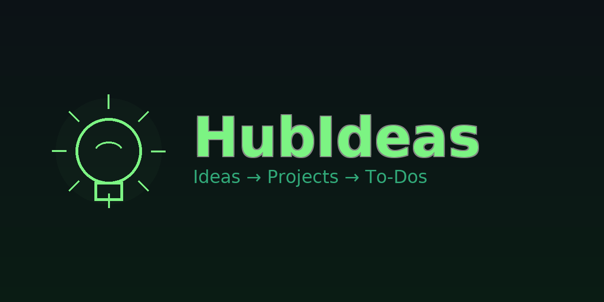
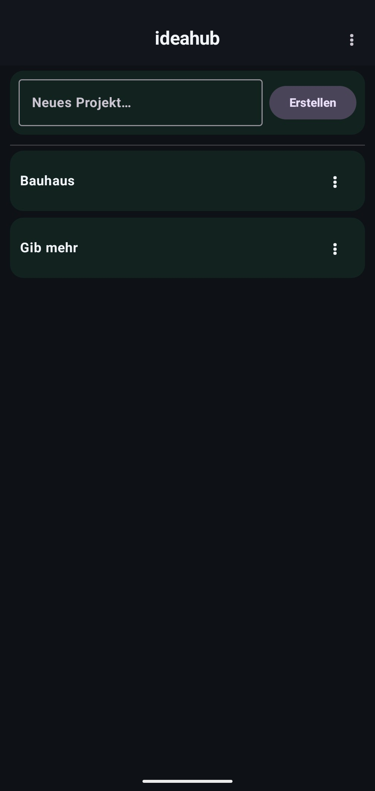
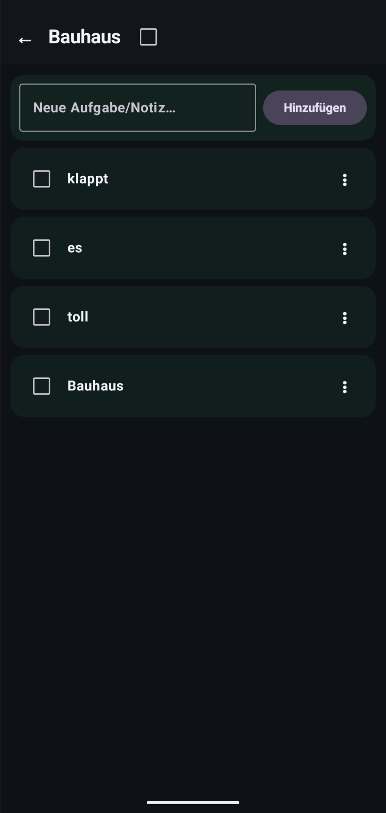
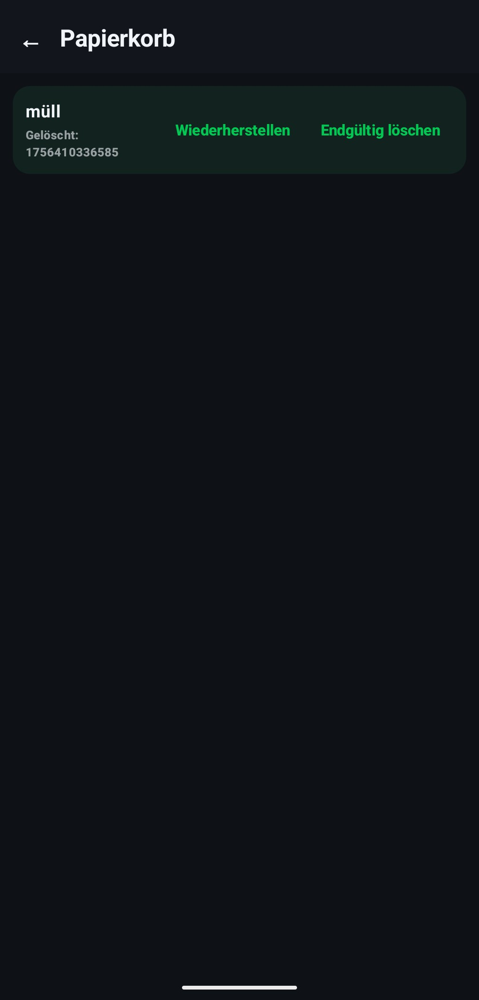

# HubIdeas 🧠✨
> Ideen schnell festhalten → Projekte → To-Dos. Mit sanftem Fokus statt Alarm-Flut.



<p align="left">
  <a href="https://kotlinlang.org/"></a>
  <a href="https://developer.android.com/jetpack/compose"></a>
  <a href="https://developer.android.com/jetpack/androidx/releases/room"></a>
  
  
  <a href="#license"></a>
</p>

---

## ✨ Features (aktueller Stand)

- 🌚 **Dark Theme** mit Material 3  
- 🗂️ **Projektübersicht**: Projekte erstellen, umbenennen, in den **Papierkorb** verschieben  
- ✅ **Projekt-Detail**: To-Dos hinzufügen, abhaken, löschen  
- 🗑️ **Papierkorb**: Projekte wiederherstellen oder endgültig löschen  
- ♻️ **Auto-Löschen**: Einträge im Papierkorb werden **nach 30 Tagen** automatisch entfernt  
- ⤴️ **Zurück-Button** in der Top-App-Bar

> **Hinweis:** Die **automatische Notiz-Erstellung** beim Anlegen eines Projekts (gleichnamige Notiz im Projekt) ist vorgesehen und bereits teilweise vorbereitet, muss aber noch finalisiert werden (siehe Roadmap).

---

## 📸 Screenshots

Lege später Bilder in `docs/screenshots/` ab und ersetze die Platzhalter:

- `docs/screenshots/cover.png`
- `docs/screenshots/projects.png`
- `docs/screenshots/detail.png`
- `docs/screenshots/trash.png`

| Start (Projekte) | Detail (To-Dos) | Papierkorb |
|---|---|---|
|  |  |  |

---

## 🚀 Setup & Start

### Voraussetzungen

- Android Studio (aktuelle Version)
- Android SDK, Gradle Wrapper (inklusive)
- Gerät/Emulator mit **minSdk 24**, **targetSdk 36**

### Start in der IDE

1. Projekt in Android Studio öffnen  
2. Modul **`app`** wählen  
3. ▶️ **Run** drücken

### Start per CLI

```bash
./gradlew assembleDebug

# APK dann z.B. via adb installieren:
adb install -r app/build/outputs/apk/debug/app-debug.apk
```

### WLAN-Debugging (Kurz)

1. Auf dem Gerät **Entwickleroptionen → Wireless debugging** aktivieren  
2. In Android Studio: **Device Manager → Pair using Wi-Fi**  
3. QR-Code scannen / Code eingeben  
4. Gerät erscheint als Zielgerät

---

## 🧱 Architektur

- **MVVM** (ViewModel, StateFlow)  
- **Jetpack Compose** (UI)  
- **Room** (lokale Datenbank mit Migrationen)  
- **Kotlin Coroutines** (asynchron)  
- **Navigation Compose** (Screen-Navigation)

---

## 🗄️ Datenmodell (vereinfacht)

**projects**

| Feld        | Typ        | Hinweise                    |
|-------------|------------|-----------------------------|
| id          | PK         |                             |
| name        | String     |                             |
| description | String?    | optional                    |
| isDone      | Boolean    |                             |
| createdAt   | Instant    |                             |
| updatedAt   | Instant?   | optional                    |
| trashedAt   | Instant?   | optional (Soft Delete)      |

**todos**

| Feld      | Typ     | Hinweise                              |
|-----------|---------|---------------------------------------|
| id        | PK      |                                       |
| projectId | FK      | **CASCADE**                           |
| title     | String  |                                       |
| isDone    | Boolean |                                       |
| createdAt | Instant |                                       |
| trashedAt | Instant?| optional (Soft Delete)                |

**notes**

| Feld      | Typ     | Hinweise                              |
|-----------|---------|---------------------------------------|
| id        | PK      |                                       |
| projectId | FK      | **RESTRICT**                          |
| content   | String  |                                       |
| createdAt | Instant |                                       |
| trashedAt | Instant?| optional (Soft Delete)                |

---

## 🗑️ Papierkorb-Logik

- **„Löschen“ = Soft Delete** → `trashedAt` wird gesetzt (Projekt und alle zugehörigen `todos`/`notes`)  
- **Wiederherstellen** → `trashedAt = NULL` (alles wiederhergestellt)  
- **Endgültig löschen** → harte Löschung in korrekter Reihenfolge (erst To-Dos, dann Notizen, dann Projekt), um FK-Fehler zu vermeiden  
- **Auto-Purge** → Beim Öffnen der DB werden Einträge mit `trashedAt < now − 30 Tage` automatisch entfernt

---

## 📁 Projektstruktur (gekürzt)

```
app/src/main/java/com/.../hubideas/
├─ data/
│  ├─ local/
│  │  ├─ AppDatabase.kt
│  │  ├─ dao/
│  │  │  ├─ ProjectDao.kt
│  │  │  ├─ TodoDao.kt
│  │  │  └─ NoteDao.kt
│  │  └─ entity/
│  │     ├─ ProjectEntity.kt
│  │     ├─ TodoEntity.kt
│  │     └─ NoteEntity.kt
│  └─ repo/
│     ├─ ProjectRepository.kt
│     └─ TodoRepository.kt
└─ ui/
   ├─ MainActivity.kt
   ├─ ProjectListViewModel.kt
   ├─ ProjectDetailViewModel.kt
   └─ TrashViewModel.kt
```

---

## 🗺️ Roadmap / Nächste Schritte

- 📝 **Auto-Notiz** beim Projekt-Anlegen (gleichnamig) vollständig aktivieren  
- ✂️ **KI-gestützte Projektnamen** (kürzen/verbessern; Original bleibt als Notiz erhalten)  
- 🔎 **Suche/Filter**, **Prioritäten**, **Fälligkeitsdaten**  
- 🔔 **Sanfte Erinnerungen** („lange nicht bearbeitet“)  
- ☁️ **Sync/Backup** (z. B. Firestore)  
- 🎨 **UI-Polish**, **Animationen**, **Tests**

---

## 🧩 Troubleshooting

- **Room: „Migration didn’t properly handle …“**  
  → App deinstallieren oder App-Daten löschen und neu starten (frische DB anlegen lassen).

- **`FOREIGN KEY constraint failed`**  
  → Tritt bei harter Löschung auf. In der App Soft Delete (Papierkorb) nutzen und endgültig in der vorgegebenen Reihenfolge löschen.

- **Gerät erscheint nicht (WLAN/USB)**  
  → USB-Debugging/Wireless-Pairing prüfen. In Android Studio im Device Manager neu koppeln.

---

## 🤝 Mitwirken

PRs willkommen! Kurze Beschreibung, ggf. Screens anhängen.

---

## 📄 License

MIT – siehe [LICENSE](LICENSE).
